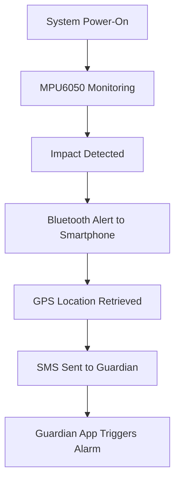

# 🪖 Smart Helmet Accident Alert System

### 🚦 A Life-Saving IoT + Android Solution for Riders

The **Smart Helmet Accident Alert System** is a cutting-edge safety innovation designed to protect motorcyclists by detecting accidents in real-time and instantly notifying guardians. By combining **ESP32**, **MPU6050**, and **Android apps**, this system ensures rapid emergency response when every second counts.

---

## 📌 Overview

This helmet-mounted system uses motion sensing and Bluetooth communication to detect crashes and alert guardians with GPS location via SMS. It features:

- **Accurate crash detection** using MPU6050 (accelerometer + gyroscope)
- **Bluetooth-based alert transmission** to a paired smartphone
- **Automated GPS + SMS notification** to a predefined guardian
- **Guardian app** that triggers siren, vibration, and popup alerts

---

## 🎯 Key Objectives

- ✅ **Precise Impact Detection** using ESP32 + MPU6050
- 📍 **Automated GPS Location Alerts** via SMS
- 📳 **Instant Guardian Notification** with siren, vibration, and popup
- 🧠 **Intelligent Workflow** for seamless accident reporting

---

## 🧱 System Architecture

### 🔩 Hardware Components

| Component              | Purpose                                      |
|------------------------|----------------------------------------------|
| ESP32 Dev Board        | Core microcontroller                         |
| MPU6050 Sensor         | Detects motion and impact                    |
| Li-Ion Battery         | Portable power supply                        |
| TP4056 Module          | Battery charging                             |
| Helmet (Prototype)     | Sensor integration platform                  |
| Power Switch           | Manual system control                        |

### 🧰 Software Tools

- **Arduino IDE** – ESP32 firmware development
- **Android Studio** – Smart Helmet & Guardian app development

---

## ⚙️ Implementation Details

### 1️⃣ ESP32 Firmware Logic

- Reads real-time data from MPU6050 via I²C
- Calculates acceleration magnitude
- Triggers Bluetooth alert if threshold is exceeded

```cpp
if (accMagSq > 7.0) {
  SerialBT.println("ACCIDENT DETECTED!");
}
```

> 💡 *Threshold can be fine-tuned for sensitivity.*

---

### 2️⃣ Smart Helmet Android App

- Connects to ESP32 via Bluetooth
- Listens for `"ACCIDENT DETECTED"` messages
- Retrieves GPS location
- Sends SMS with Google Maps link to guardian
- Includes settings for guardian contact

---

### 3️⃣ Guardian Android App

- Monitors incoming SMS alerts
- On detection:
  - 🔊 Plays siren
  - 📳 Vibrates phone
  - ⚠️ Displays popup alert
- Optional: Override DND mode for emergency alerts

---

## 🔄 Workflow Summary



---

## 🛠️ Technology Stack

| Category     | Tools & Components                          |
|--------------|---------------------------------------------|
| Hardware     | ESP32, MPU6050, Li-Ion, TP4056              |
| Firmware     | Arduino (C/C++)                             |
| Mobile Apps  | Android (Java/Kotlin)                       |
| Connectivity | Bluetooth Serial                            |
| Services     | GPS, SMS API                                |

---

## 🚀 Future Enhancements

- 🔗 Direct integration with emergency services
- 🚲 Fall detection for bicycles and scooters
- ☁️ Cloud-based crash data analytics

---

## ❤️ Impact

This system empowers riders with a **smart safety net**, ensuring that help is just a heartbeat away in the event of an accident. It’s more than just a helmet—it’s a guardian.

---

